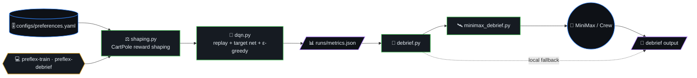
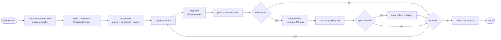
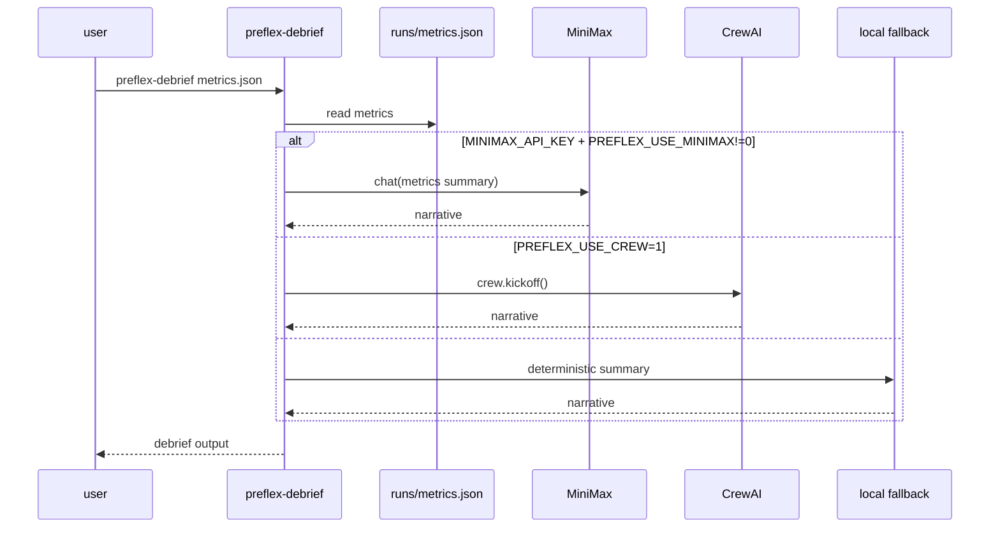
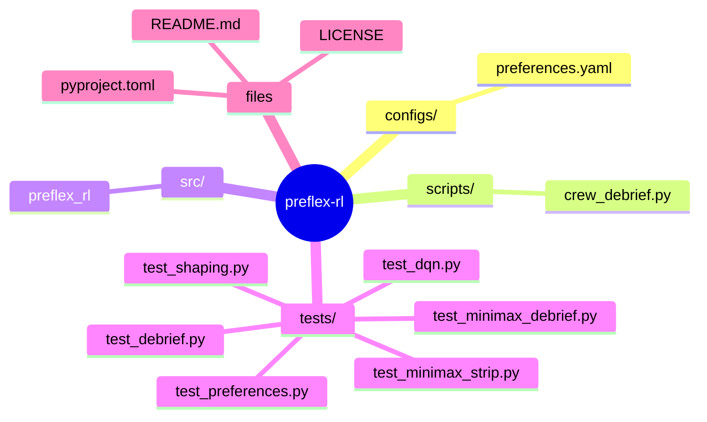
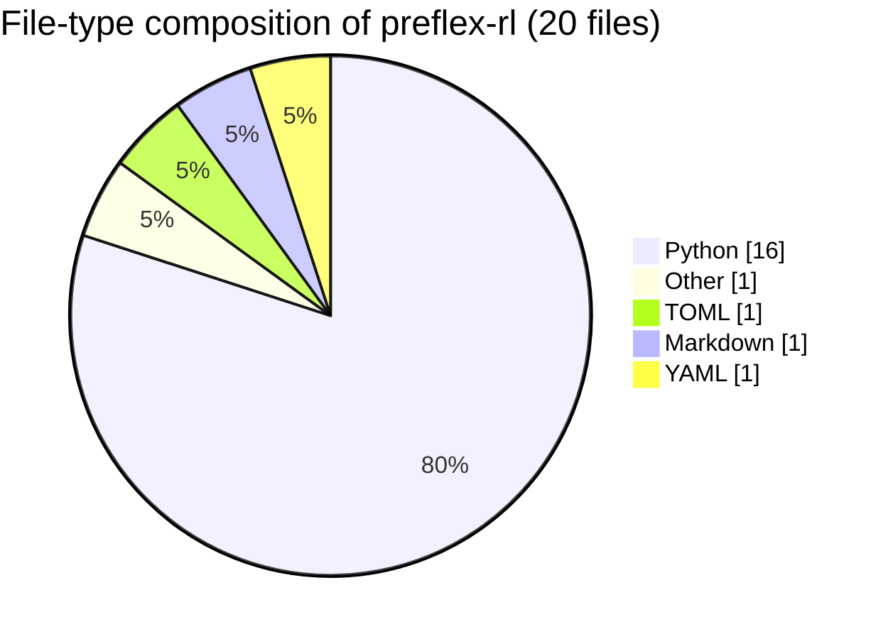

# Preflex RL

**Preflex** = *preference-flexible* reinforcement learning: a **real DQN** trainer on **CartPole-v1** where you steer behavior with **interpretable YAML preferences** (velocity smoothing, anti-thrashing), not a template-only repo.



## Table of contents

- [What this is](#what-this-is)
- [Training loop (algorithm)](#training-loop-algorithm)
- [Debrief sequence](#debrief-sequence)
- [Quick start](#quick-start)
- [Layout](#layout)
- [License](#license)
- [🗺️ Repository map](#️-repository-map)
- [📊 Code composition](#-code-composition)

## Training loop (algorithm)



## Debrief sequence



## What this is

- **RL core:** PyTorch DQN with replay buffer, target network, ε-greedy exploration.
- **Idea:** Add **reward shaping** from human-readable weights (`configs/preferences.yaml`) so you can trade off pole stability vs raw return before touching network code.
- **MiniMax debrief (default):** After training, `preflex-debrief` calls the **MiniMax OpenAI-compatible API** using `MINIMAX_*` variables from `.env` (see `.env.example`). Set `PREFLEX_USE_MINIMAX=0` to skip the API and fall back to a local summary.
- **CrewAI (optional):** Install `pip install -e '.[crew]'` and set `PREFLEX_USE_CREW=1` if you prefer a Crew crew instead; MiniMax is tried first when `MINIMAX_API_KEY` is set.

### Secrets

- Copy `.env.example` → `.env` and add your keys. **`.env` is gitignored** — never commit it.
- If a key was pasted into chat or a ticket, **rotate it** in the MiniMax console and update `.env`.

## Quick start

```bash
python3 -m venv .venv && source .venv/bin/activate
pip install -e ".[dev]"
pytest
cp .env.example .env   # then edit with MINIMAX_API_KEY
preflex-train --steps 15000 --metrics-out runs/metrics.json
preflex-debrief runs/metrics.json
```

Same as: `python -m preflex_rl` (runs the debrief CLI).

Smoke / CI-sized run:

```bash
preflex-train --smoke --steps 400 --metrics-out runs/metrics.json
```

## Layout

| Path | Role |
|------|------|
| `src/preflex_rl/dqn.py` | DQN + replay |
| `src/preflex_rl/shaping.py` | CartPole shaping wrapper |
| `src/preflex_rl/train.py` | Training loop + metrics JSON |
| `src/preflex_rl/minimax_debrief.py` | MiniMax chat debrief |
| `src/preflex_rl/debrief.py` | CLI: MiniMax → CrewAI → local fallback |
| `configs/preferences.yaml` | Tunable preference weights |
| `scripts/crew_debrief.py` | Thin wrapper → `preflex_rl.debrief` |

## License

MIT


## 🗺️ Repository map

Top-level layout of `preflex-rl` rendered as a Mermaid mindmap (auto-generated from the on-disk tree).




## 📊 Code composition

File-type breakdown of source under this repo (skips `.git`, `node_modules`, build caches, lockfiles).


